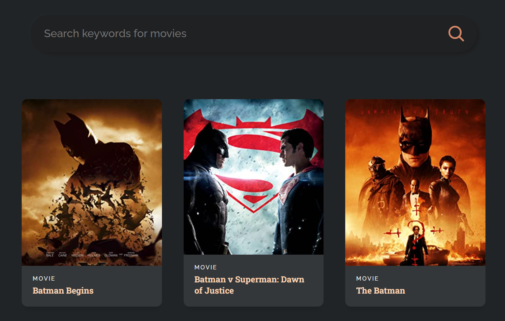

<h1>React Learning App - Movieland
</h1>

## 1. Preview



> demo: [https://mr-addict.github.io/movieland](https://mr-addict.github.io/movieland)

## 2. Commands

### deploy

```bash
npm start
```

### build

```bash
npm run build 
```
